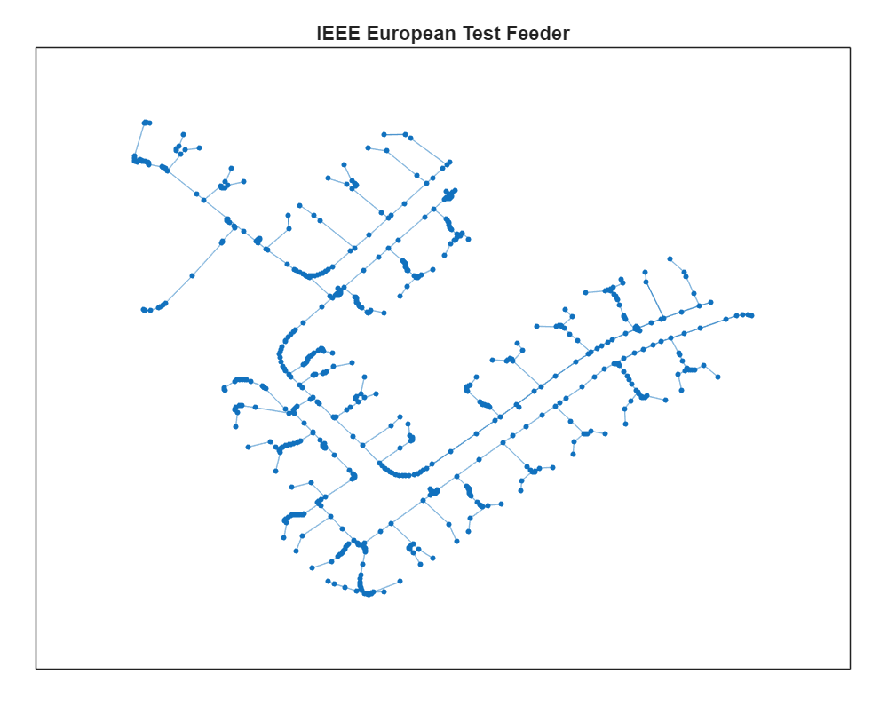
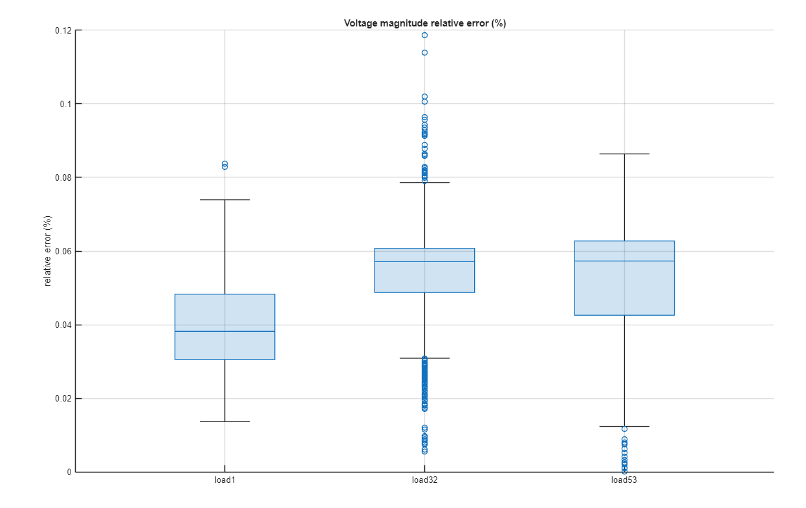

# Simscape Electrical - IEEE European Test Feeder EMT model

Version 1.0.0

## Introduction

This project provides code and resources that programmatically builds an EMT model of the IEEE
European Test Feeder. An image of the network is shown below. Two model builds are available.
One builds the network as 4 segments using model reference. With model reference, we can build
the segments as executable MEX files that do not need to be recompiled. The other builds the
network as 4 segments using subsystem reference. With subsystem reference, we can use Fast-Restart
in a given simulation session to avoid model re-compilation when simulating many scenarios.

A benchmark quasi-static EMT model is built and
the bus voltage magnitudes compared with the benchmark results.
The bus voltage magnitude relative errors for three loads are shown below.
This model can be used to change constant PQ 
load setpoints as the simulation progresses. Note that the benchmark results are 
for a 24 hour period at one minute time-steps, meaning there are 1,440 
operational changes. For the quasi-static EMT simulation, we change set-point
every 2 cycles. The results below are for Ts = 5e-5s, and we compare RMS results
with the benchmark values.
The percentage relative error of benchmark load voltages is less than 0.12%
at all instances, with average relative error on each phase below 0.06%.

### Reference

[2] R. C. Dugan, W. H. Kersting, S. Carneiro, R. F. Arritt, and T. E. McDermott,
"Roadmap for the IEEE PES test feeders,"
IEEE Power Systems Conference and Exposition, pp.1-4, March 2009.

## Tool Requirements

Supported MATLAB Version:
R2025b and newer releases

Required:
* [MATLAB&reg;](https://www.mathworks.com/products/matlab.html)
* [Simulink&reg;](https://www.mathworks.com/products/simulink.html)
* [Simscape&trade;](https://www.mathworks.com/products/simscape.html)
* [Simscape&trade; Electrical&trade;](https://www.mathworks.com/products/simscape-electrical.html)

## How to Use

You must first download the data for the IEEE European Test Feeder from the following link.

[IEEE PES Test Feeder](https://cmte.ieee.org/pes-testfeeders/resources)

Navigate to 2015 Test Feeder Cases and click on European Low Voltage Test Feeder to download 
a .zip file of the network data and benchmark results. Unzip the file in
the main directory. This will add a directory called European_LV_Test_Feeder_v2.

Open `Simscape_Electrical_IEEE_European.prj` in MATLAB. Once the project is installed, add the
European_LV_Test_Feeder_v2 directory to the project path.

To build and run the benchmark model, navigate to the create_benchmark_model
directory and open and run create_IEEE_European_EMT_MR.mlx for a build using
model reference, and open and run create_IEEE_European_EMT_SR.mlx for a build
using subsystem reference. If using MATLAB Online, we recommend using the 
subsystem reference model.

## How to Use in MATLAB Online

You can try this in [MATLAB Online][url_online].
In MATLAB Online, from the **HOME** tab in the toolstrip,
select **Add-Ons** &gt; **Get Add-Ons**
to open the Add-On Explorer.
Then search for the submission name,
navigate to the submission page,
click **Add** button, and select **Save to MATLAB Drive**.

[url_online]: https://www.mathworks.com/products/matlab-online.html

## License

See [`LICENSE.txt`](LICENSE.txt).

_Copyright (C) 2026, The MathWorks, Inc._
